# [*BAH* Dataset for Ambivalence/Hesitancy Recognition in Videos for Behavioural Change](https://arxiv.org/pdf/2505.19328)


by
**Manuela González-González<sup>3,4</sup>,
Soufiane Belharbi<sup>1</sup>,
Muhammad Osama Zeeshan<sup>1</sup>,
Masoumeh Sharafi<sup>1</sup>,
Muhammad Haseeb Aslam<sup>1</sup>,
Alessandro Lameiras Koerich<sup>2</sup>,
Marco Pedersoli<sup>1</sup>,
Simon L. Bacon<sup>3,4</sup>,
Eric Granger<sup>1</sup>**

<sup>1</sup> LIVIA, Dept. of Systems Engineering, ETS Montreal, Canada
<br/>
<sup>2</sup> LIVIA, Dept. of Software and IT Engineering, ETS Montreal, Canada
<br/>
<sup>3</sup> Dept. of Health, Kinesiology, \& Applied Physiology, Concordia University, Montreal, Canada
<br/>
<sup>4</sup> Montreal Behavioural Medicine Centre, CIUSSS Nord-de-l’Ile-de-Montréal, Canada


<p align="center">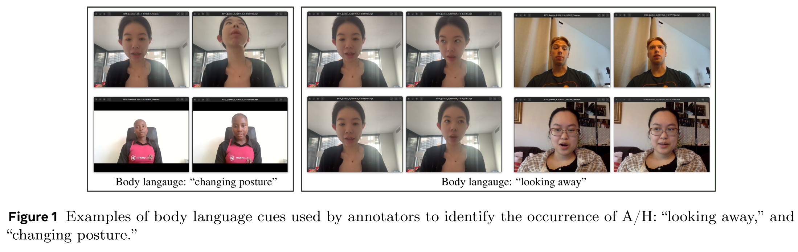</p>
<!-- <br/> -->
<p align="center"></p>

[](https://sbelharbi.github.io/bah-dataset)
[](https://arxiv.org/pdf/2505.19328)
[](https://huggingface.co/sbelharbi/bah-dataset)

## Abstract
Recognizing complex emotions linked to ambivalence and hesitancy (A/H) can play
a critical role in the personalization and effectiveness of digital behaviour
change interventions. These subtle and conflicting emotions are manifested by
a discord between multiple modalities, such as facial and vocal expressions,
and body language. Although experts can be trained to identify A/H, integrating
them into digital interventions is costly and less effective.
Automatic learning systems provide a cost-effective alternative that can adapt
to individual users, and operate  seamlessly within real-time, resource-limited
 environments. However, there are currently no datasets available for the design
 of ML models to recognize A/H.
This paper introduces a first Behavioural Ambivalence/Hesitancy (*BAH*) dataset
collected for subject-based multimodal recognition of A/H in videos.  It
contains videos from 224 subjects captured across 9 provinces in Canada, with
different age, and ethnicity. Through our web platform, we recruited subjects
to answer 7 questions, some of which were designed to elicit A/H while recording
 themselves via webcam with microphone. *BAH* amounts to 1,118 videos for a total
 duration of 8.26 hours with 1.5 hours of A/H.  Our behavioural team annotated
 timestamp segments to indicate where A/H occurs, and provide frame- and
 video-level annotations with the A/H cues. Video transcripts and their
 timestamps are also included, along with cropped and aligned faces in each
 frame, and a variety of subject meta-data.
Additionally, this paper provides preliminary benchmarking results baseline
models for *BAH* at frame- and video-level recognition with mono- and multi-modal
setups. It also includes results on models for zero-shot prediction, and for
personalization using unsupervised domain adaptation. The limited performance
of baseline models highlights the challenges of recognizing A/H in real-world
videos.


**Code: Pytorch 2.2.2**


## Citation:
```
@article{gonzalez-25-bah,
  title={{BAH} Dataset for Ambivalence/Hesitancy Recognition in Videos for Behavioural Change},
  author={González-González, M. and Belharbi, S. and Zeeshan, M. O. and
    Sharafi, M. and Aslam, M. H and Pedersoli, M. and Koerich, A. L. and
    Bacon, S. L. and Granger, E.},
  journal={CoRR},
  volume={abs/2505.19328},
  year={2025}
}
```


## Content:
<!-- * [Overview](#overview) -->
* [*BAH* dataset: Download](#download-bah)
* [*BAH* dataset: Splits](#splits-bah)
* [Installation of the environments](#reqs)
* [Supported modalities](#smodal)
* [Pre-processing](#prep)
* [Run code](#run)
* [Pretrained weights (evaluation)](#weights)
* [*BAH* presentation](#bah)


## <a name='download-bah'> *BAH* dataset: Download </a>

```diff
PLEASE NOTE THAT SINCE 11TH JAN 21026, WE ARE EXPERIENCING AN ISSUE WITH THE REQUEST FORM PAGE [https://www.crhscm.ca/redcap/surveys/?s=LDMDDJR3AT9P37JY](https://www.crhscm.ca/redcap/surveys/?s=LDMDDJR3AT9P37JY). IT IS TEMPORARILY UNAVAILABLE. WE ARE WORKING TO RESTORE IT BACK ONLINE AS SOON AS POSSIBLE. WE APOLOGIZE FOR THIS ISSUE.
```
To download BAH dataset, please fill in the following form which includes signing and uploading the End-User License Agreement (EULA). You will receive a link to download *BAH* dataset.


```diff
- PLEASE FILL IN THE DATASET REQUEST FORM CAREFULLY TO AVOID ERRORS/DELAYS.
- PLEASE FOLLOW THE NEXT INSTRUCTIONS.
```

* *BAH* DATASET REQUEST FORM: [https://www.crhscm.ca/redcap/surveys/?s=LDMDDJR3AT9P37JY](https://www.crhscm.ca/redcap/surveys/?s=LDMDDJR3AT9P37JY)


* For the certification: `I certify that neither myself nor any of my research team are directly associated with an institution or organisation on Canada's Named Research Organisations List (see https://science.gc.ca/site/science/en/safeguarding-your-research/guidelines-and-tools-implement-research-security/sensitive-technology-research-and-affiliations-concern/named-research-organizations).`

```diff
- PLEASE ENSURE THAT THE AFFILIATION OF THE MAIN APPLICANT AND ANYONE HAVING
- ACCESS TO THE DATASET DOES NOT SHOW ON THE LIST OF ORGANIZATIONS LISTED IN THE LINK.
- IF YOU CHOOSE `NO` AS ANSWER, UNFORTUNATELY, THE DATASET CAN NOT BE PROVIDED DUE
- TO LEGAL AND ETHICAL REASONS OUT OF OUR CONTROL.
```
<p align="center">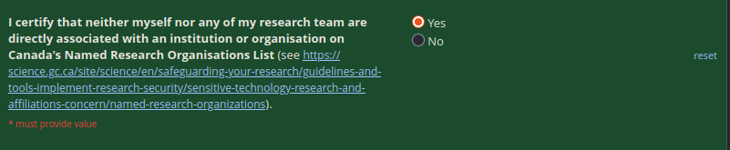</p>

Search affiliations/institutions/organisations in the provided link [https://science.gc.ca/site/science/en/safeguarding-your-research/guidelines-and-tools-implement-research-security/sensitive-technology-research-and-affiliations-concern/named-research-organizations](https://science.gc.ca/site/science/en/safeguarding-your-research/guidelines-and-tools-implement-research-security/sensitive-technology-research-and-affiliations-concern/named-research-organizations):

<p align="center">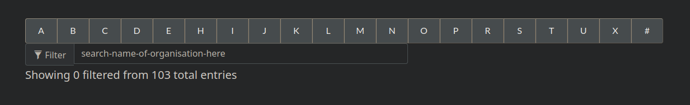</p>


* For the question `What is the primary purpose of your request for access to the dataset?`:

```diff
- PLEASE CHOOSE THE OPTION: "I am requesting access for other academic research purposes
- (e.g., thesis, lab project, independent study)."
- CURRENTLY, WE DO NOT PROVIDE BAH DATASET FOR ANY CHALLENGE.
- THE CURRENT PROVIDED BAH DATASET VERSION CAN NOT BE USED FOR CHALLENGES.
```

<p align="center"></p>


* For the section `Intended Use of the Dataset`:

```diff
- PLEASE PROVIDE SUFFICIENT SUMMARY OF THE INTENDED USES OF THIS DATASET.
- PLEASE AVOID 1-2 SENTENCES.
```

<p align="center">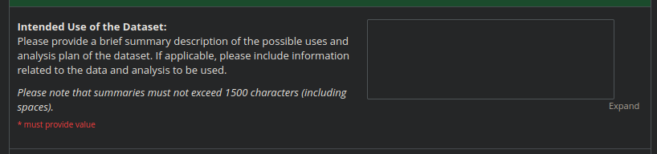</p>


* For the section `Possible products`:

```diff
- PLEASE PROVIDE SUFFICIENT SUMMARY OF THE POSSIBLE PRODUCTS INTENDED FROM THIS DATASET.
- PLEASE AVOID 1-2 SENTENCES.
```

<p align="center">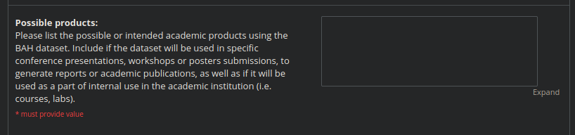</p>


* If you have questions while filling in the request form, please contact us.


## <a name='splits-bah'> *BAH* dataset: Splits </a>
We provide *BAH* dataset splits for both scenarios:
- Supervised learning: at video and frame level are located at [dataset-splits](./dataset-splits).
- Domain adaptation: coming up soon.

## <a name='reqs'> Installation of the environments
```bash
# Face cropping and alignment virtual env.
./create_v_env_face_extract.sh

# Pre-processing and training virtual env.
./create_v_env_main.sh
```

## <a name='smodal'> Supported modalities
- Vision: `vision`
- Audio: `vggish`
- Text: `bert`


## <a name='prep'> Pre-processing

Read [./abaw5_pre_processing/README.txt](./abaw5_pre_processing/README.txt)
and download the required file and unzip it. Adjust `get_root_wsol_dataset()
` in [./abaw5_pre_processing/dlib/tools.py](./abaw5_pre_processing/dlib/tools.py)
and in [./default_config.py](./default_config.py) to point to the absolute path
of the folder containing the datasets folders, e.g.: `/a/b/c/d/datasets`. Inside,
there should be the needed datasets folders, e.g.: `BAH_DB`. Download pretrained weights `vggish.pth` and
`res50_ir_0.887.pth` from [here](https://drive.google.com/drive/folders/1yh0vVY-AlwVCDxdAUy_c6e9fVbXUSnF5?usp=sharing)
into the folder [./pretrained_models](./pretrained_models).


1. **Face cropping and alignment**: Here is an example of processing `BAH_DB`, which is divided data into 8 blocks, and we process block 0.

```bash
#!/usr/bin/env bash

source ~/venvs/bah-main-face-extract/bin/activate

cudaid=$1
export CUDA_VISIBLE_DEVICES=$cudaid

python abaw5_pre_processing/dlib/bah_db.py --ds BAH_DB --split train --nblocks 8 --process_block 0
python abaw5_pre_processing/dlib/bah_db.py --ds BAH_DB --split val --nblocks 8 --process_block 0
python abaw5_pre_processing/dlib/bah_db.py --ds BAH_DB --split test --nblocks 8 --process_block 0
```

2. **Feature extraction**:

```bash
#!/usr/bin/env bash

source ~/venvs/bah-main/bin/activate

cudaid=$1
export CUDA_VISIBLE_DEVICES=$cudaid


python abaw5_pre_processing/project/abaw5/main.py --ds BAH_DB --split val --nparts 1 --part 0
python abaw5_pre_processing/project/abaw5/main.py --ds BAH_DB --split test --nparts 1 --part 0
python abaw5_pre_processing/project/abaw5/main.py --ds BAH_DB --split train --nparts 1 --part 0

# ==============================================================================
```
Since feature extraction is done by block, we need to gather all the blocks
for some results files `processing_records*`, and `dataset_info*`. These 2
files need to hold some information for all data. Run:

```bash
python post_feature_extract.py
```
Before running this, change the name of the dataset in `post_feature_extract.py`.

3. **Compact of face images**: Cropped faces need to be compacted into a
   single file, similarly to other modalities. Example:

```bash
#!/usr/bin/env bash

source ~/venvs/bah-main-face-extract/bin/activate

cudaid=$1
export CUDA_VISIBLE_DEVICES=$cudaid

python abaw5_pre_processing/dlib/compact_face_images.py --ds BAH_DB --split train --nparts 1 --part 0
python abaw5_pre_processing/dlib/compact_face_images.py --ds BAH_DB --split val --nparts 1 --part 0
python abaw5_pre_processing/dlib/compact_face_images.py --ds BAH_DB --split test --nparts 1 --part 0

```

5. **Override frame label**: `set_frame_labels.py` with `overload_real_frame_labels()`

## Training
```bash
#!/usr/bin/env bash

source ~/venvs/bah-main/bin/activate

# ==============================================================================
cudaid=$1
export CUDA_VISIBLE_DEVICES=$cudaid


python main.py \
       --train_supervision_type video_fr_sup \
       --dataset_name BAH_DB \
       --use_other_class False \
       --train_p 100.0 \
       --valid_p 100.0 \
       --test_p 100.0 \
       --amp True \
       --seed 0 \
       --mode TRAINING \
       --resume False \
       --modality video+vggish+bert+EXPR_continuous_label \
       --calc_mean_std True \
       --emotion LATER \
       --model_name JMT \
       --num_folds 1 \
       --fold_to_run 0 \
       --use_pretrained_w False \
       --visual_backbone_path None \
       --num_heads 2 \
       --modal_dim 32 \
       --tcn_kernel_size 5 \
       --num_epochs 60 \
       --min_num_epochs 3 \
       --early_stopping 50 \
       --window_length 696 \
       --hop_length 48 \
       --train_batch_size 4 \
       --eval_batch_size 1 \
       --num_workers 12 \
       --opt__weight_decay 0.0001 \
       --opt__name_optimizer SGD \
       --opt__lr 0.008 \
       --opt__momentum 0.9 \
       --opt__dampening 0.0 \
       --opt__nesterov True \
       --opt__beta1 0.9 \
       --opt__beta2 0.999 \
       --opt__eps_adam 1e-08 \
       --opt__amsgrad False \
       --opt__lr_scheduler True \
       --opt__name_lr_scheduler MYSTEP \
       --opt__gamma 0.9 \
       --opt__step_size 50 \
       --opt__last_epoch -1 \
       --opt__min_lr 1e-07 \
       --opt__t_max 100 \
       --opt__mode MIN \
       --opt__factor 0.5 \
       --opt__patience 10 \
       --opt__gradual_release 1 \
       --opt__release_count 3 \
       --opt__milestone 0 \
       --opt__load_best_at_each_epoch False \
       --exp_id 05_14_2025_14_18_15_411877__5413229
```

## <a name='bah'> *BAH* presentation </a>

### *BAH*: Capture & Annotation

<p align="center">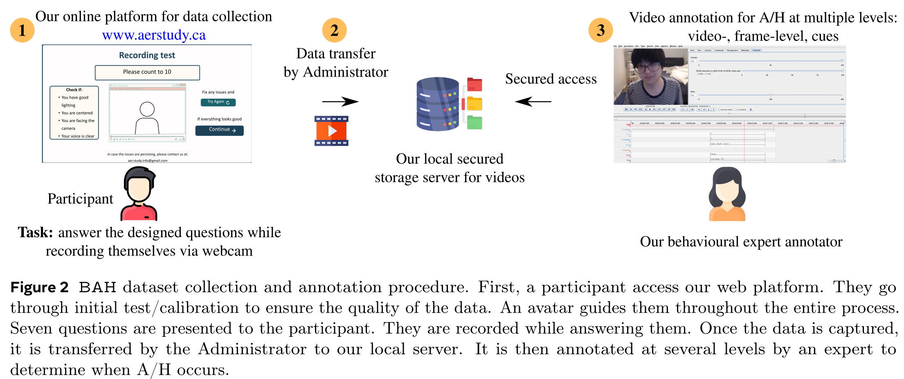</p>
<!-- <br/> -->
<p align="center">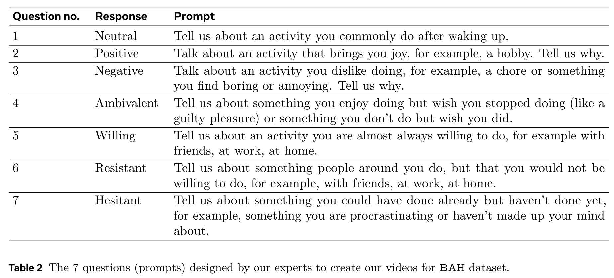</p>
<br/>

### *BAH*: Variability


<p align="center">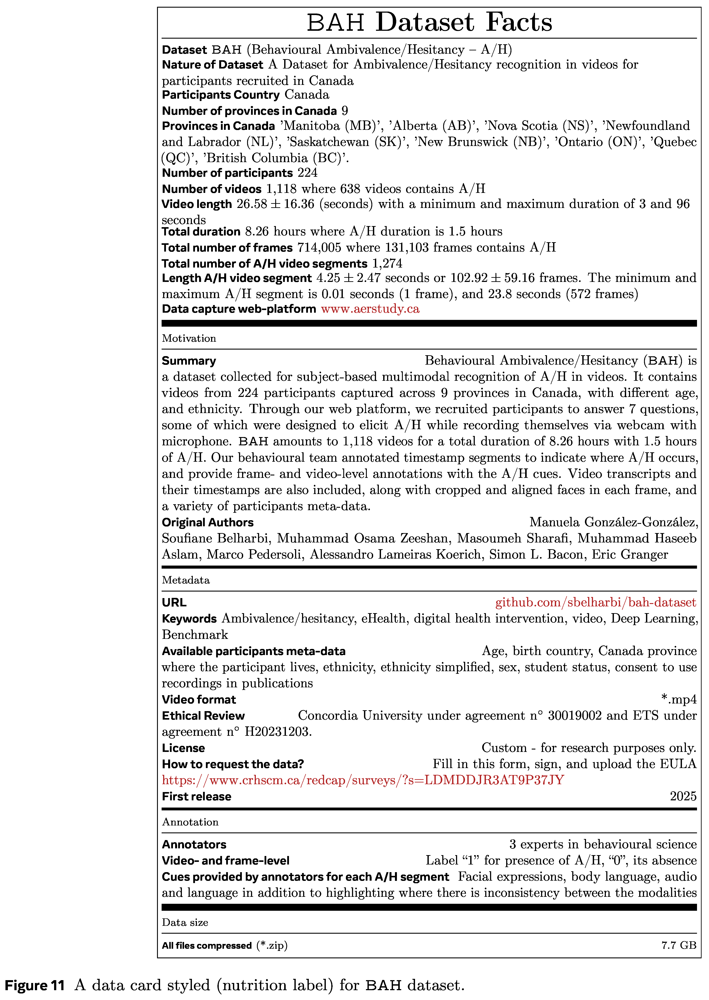</p>
<!-- <br/> -->

<p align="center">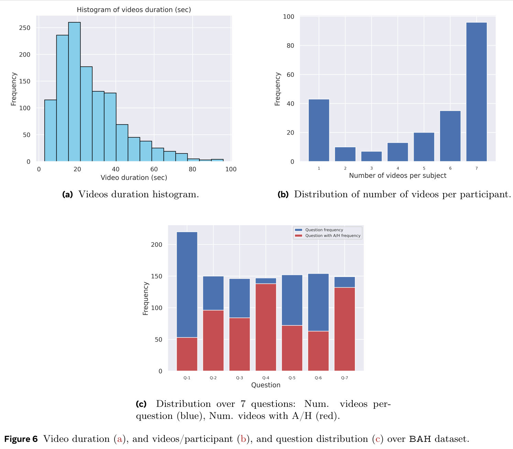</p>
<!-- <br/> -->
<p align="center">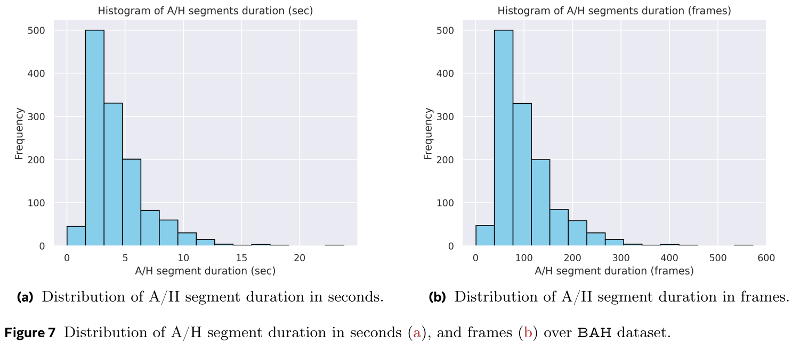</p>
<!-- <br/> -->
<p align="center">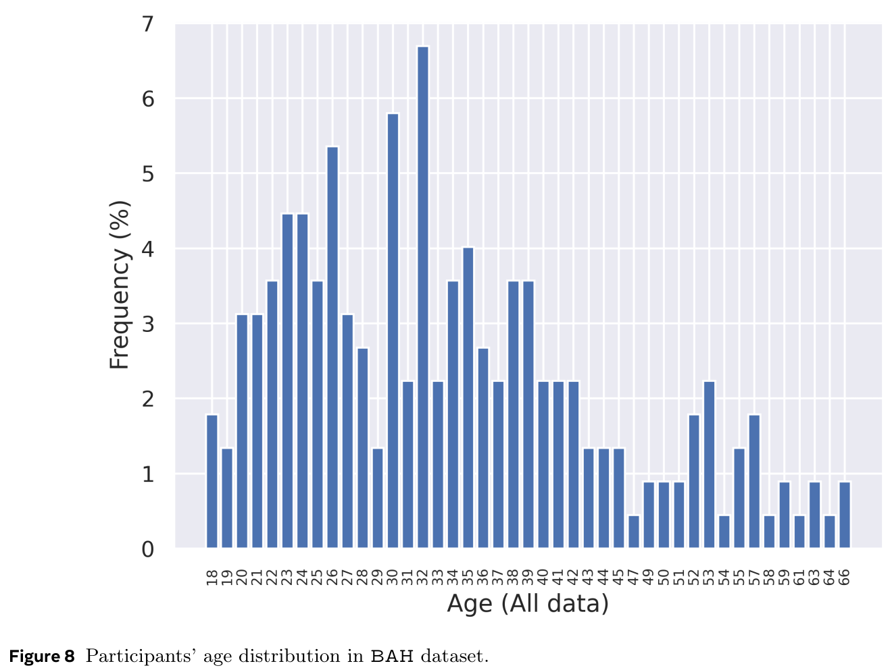</p>
<!-- <br/> -->
<p align="center">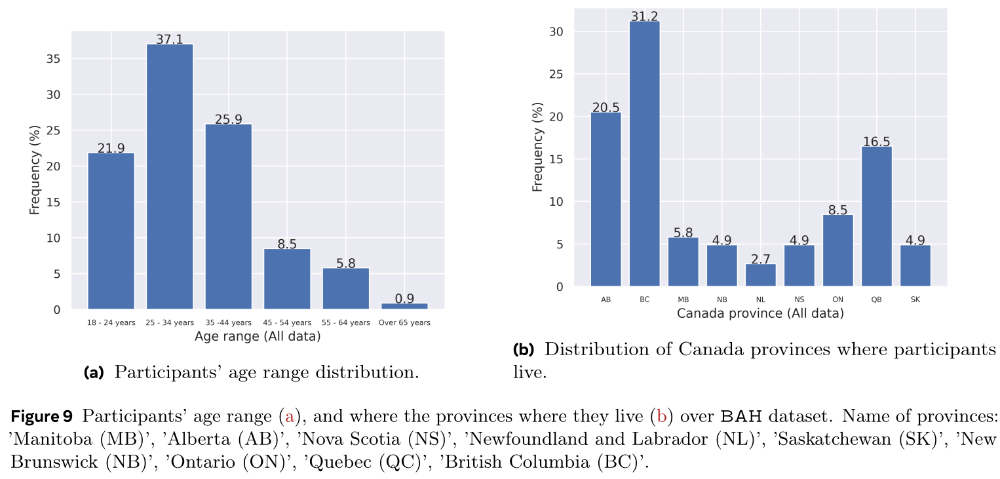</p>
<!-- <br/> -->
<p align="center">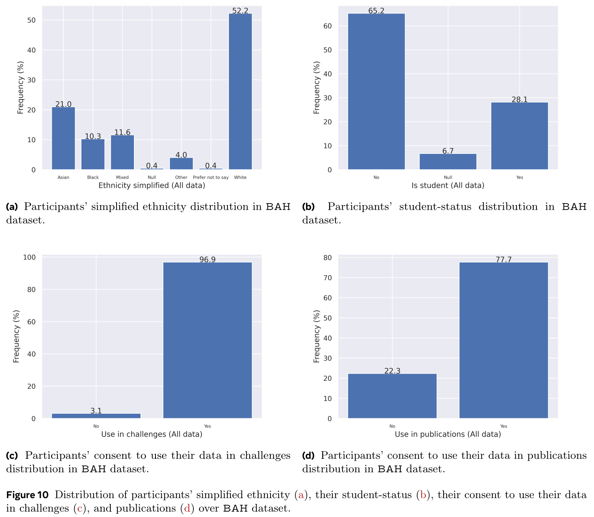</p>
<br/>


### *BAH*: Experimental Protocol

<p align="center">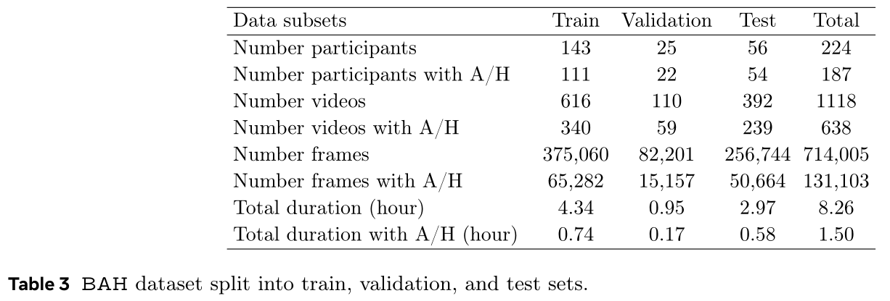</p>
<!-- <br/> -->
<p align="center">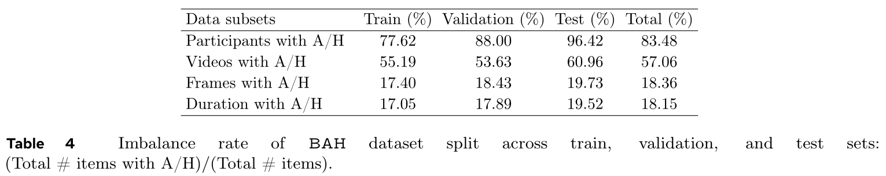</p>
<br/>


### Experiments: Baselines

#### 1) Frame-level supervised classification using multimodal
<p align="center">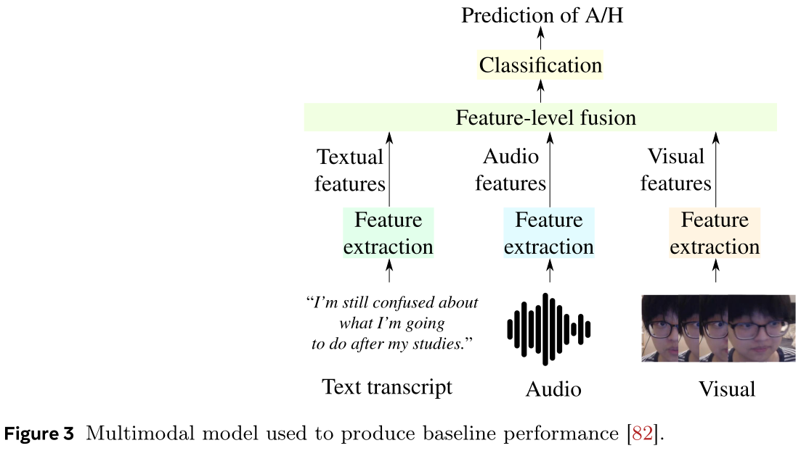</p>
<!-- <br/> -->
<p align="center">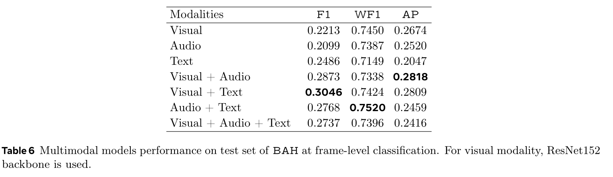</p>
<!-- <br/> -->
<p align="center">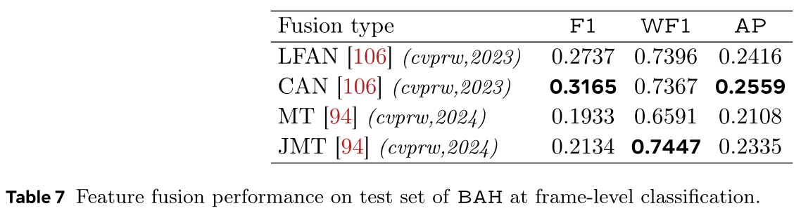</p>
<br/>


#### 2) Video-level supervised classification using multimodal

<p align="center">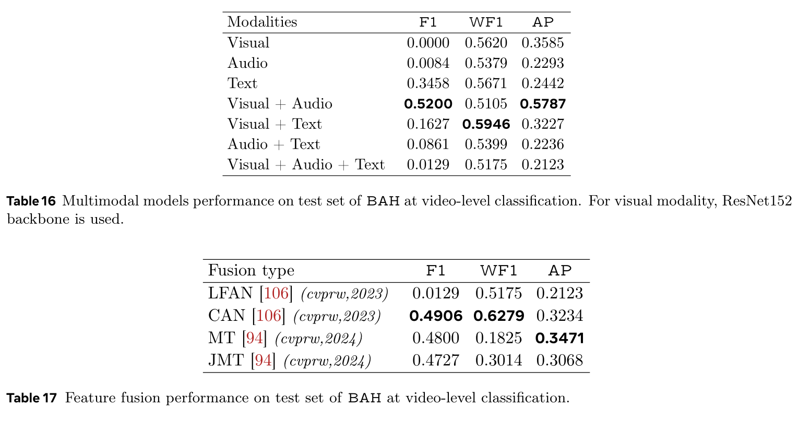</p>
<br/>


#### 3) Zero-shot performance: Frame- & video-level

<p align="center">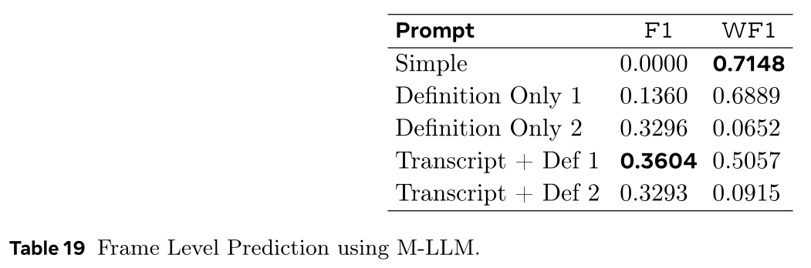</p>
<!-- <br/> -->
<p align="center">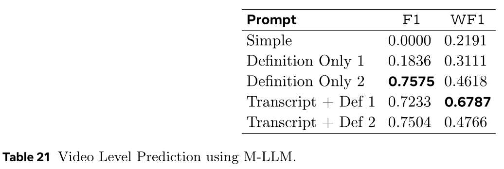</p>
<br/>


#### 4) Personalization using domain adaptation (frame-level)

<p align="center">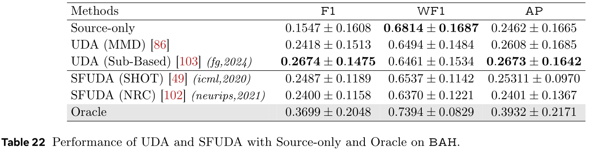</p>
<br/>


### Conclusion

This work introduces a new and unique multimodal and subject-based video dataset, *BAH*, for A/H recognition in videos.
*BAH* contains 224 participants across 9 provinces in Canada. Recruited participants answer 7 designed questions to elicit A/H while recording themselves via webcam and microphone via our web-platform. The dataset amounts to 1,118 videos for a total duration of 8.26 hours with 1.5 hours of A/H. It was annotated by our behavioural team at video- and frame-level.

Our initial benchmarking yielded limited performance highlighting the difficulty of A/H recognition. Our results showed also that leveraging context, multimodality, and adapted feature fusion is a first good direction to design robust models. Our dataset and code are made public.


### Acknowledgments
This work was supported in part by the Fonds de recherche du Québec – Santé, the Natural Sciences and Engineering Research Council of Canada, Canada Foundation for Innovation, and the Digital Research Alliance of Canada. We thank interns that participated in the dataset annotation: Jessica Almeida (Concordia University, Université du Québec à Montréal), and Laura Lucia Ortiz (MBMC).


## Thanks
This code is heavily based on [github.com/sucv/ABAW3](https://github.com/sucv/ABAW3).
